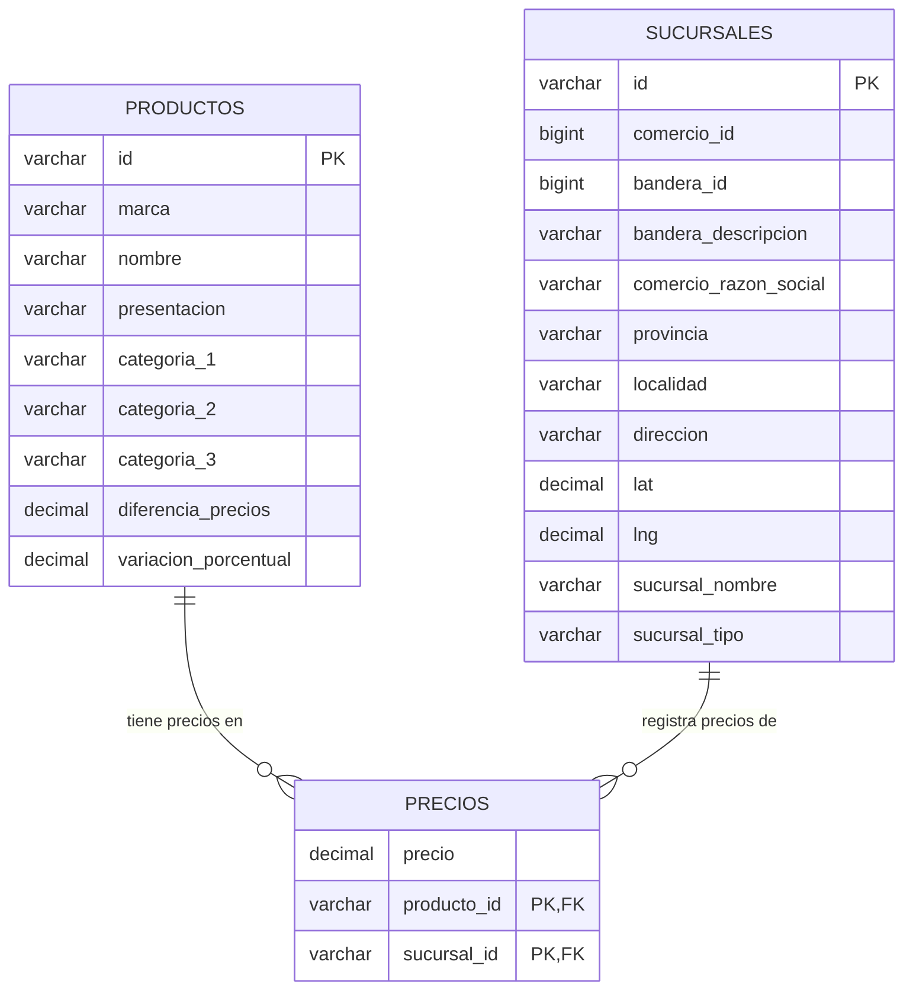

# Diseño de la base de datos

## 1. Descripción

La base de datos `datos_comercios` fue diseñada para almacenar y analizar información sobre productos, precios y sucursales comerciales de la provincia de Córdoba.

Los datos originales provienen de archivos CSV (dataset "Precios Claros - SEPA") y fueron previamente procesados para:

- Conservar únicamente las sucursales de Córdoba (código de provincia `AR-X`).
- Normalizar los nombres de las columnas utilizando `snake_case`.
- Mantener los identificadores originales de productos y sucursales.
- Quedarse con un único precio vigente por producto y sucursal (ver [Calidad de datos](#4-calidad-de-datos-y-limpieza)).

La base de datos está compuesta por tres tablas:

- `productos`
- `sucursales`
- `precios`

---

## 2. Comparación formal de las bases de datos candidatas

Antes de elegir el dataset se evaluaron tres alternativas por los mismos criterios:

| Criterio | REFES (establecimientos de salud) | Padrón de establecimientos educativos | Precios Claros - SEPA |
|---|---|---|---|
| Volumen de registros | Medio (miles de establecimientos) | Medio (miles de establecimientos) | Muy alto (millones de precios) |
| Posibilidad de relacionar 3+ entidades | Baja (principalmente una tabla plana) | Baja (principalmente una tabla plana) | Alta (productos, sucursales y precios) |
| Frecuencia de consulta / uso cotidiano | Baja-media | Baja-media | Alta (los precios se consultan a diario) |
| Riqueza para análisis numérico (promedios, máximos, agrupaciones) | Baja | Baja | Alta (precio es una variable numérica con múltiples agrupaciones posibles: producto, comercio, categoría, localidad) |
| Posibilidad de acotar el dataset (ej. por provincia) | Sí | Sí | Sí (se filtró por Córdoba) |
| Impacto social percibido por el grupo | Medio | Medio | Alto |

**Conclusión:** Precios Claros - SEPA fue la opción elegida por ser la que mejor permite construir un modelo relacional de varias tablas con relaciones reales (no solo una tabla plana), y por el mayor volumen y variedad de datos para aplicar limpieza, transformación y análisis.

---

## 3. Modelo relacional

La estructura de la base de datos es:

```text
productos 1 ───────── N precios N ───────── 1 sucursales
```

`precios` es la tabla asociativa (o "tabla puente") entre `productos` y `sucursales`: cada fila indica el precio de un producto puntual en una sucursal puntual.

### Diagrama entidad-relación

> **Nota:** este diagrama se generó como referencia rápida dentro del repositorio. **No reemplaza** la captura pedida en la consigna (el DER exportado como imagen desde MySQL Workbench); esa captura debe agregarse al informe además de este diagrama.



---

## 4. Tablas

### Tabla `productos`

Contiene la información de los productos, obtenidos de `productos.csv`.

| Campo | Tipo | Clave |
|---|---|---|
| id | VARCHAR(50) | PK |
| marca | VARCHAR(150) | |
| nombre | VARCHAR(255) | |
| presentacion | VARCHAR(100) | |
| categoria_1 | VARCHAR(150) | |
| categoria_2 | VARCHAR(150) | |
| categoria_3 | VARCHAR(150) | |
| diferencia_precios | DECIMAL(12,2) | campo calculado |
| variacion_porcentual | DECIMAL(12,2) | campo calculado |

### Tabla `sucursales`

Contiene la información de las sucursales comerciales de Córdoba (filtradas con el código de provincia `AR-X`).

| Campo | Tipo | Clave |
|---|---|---|
| id | VARCHAR(50) | PK |
| comercio_id | BIGINT | |
| bandera_id | BIGINT | |
| bandera_descripcion | VARCHAR(255) | |
| comercio_razon_social | VARCHAR(255) | |
| provincia | VARCHAR(10) | |
| localidad | VARCHAR(255) | |
| direccion | VARCHAR(500) | |
| lat | DECIMAL(10,7) | |
| lng | DECIMAL(10,7) | |
| sucursal_nombre | VARCHAR(255) | |
| sucursal_tipo | VARCHAR(100) | |

### Tabla `precios`

Es la tabla asociativa entre `productos` y `sucursales`.

| Campo | Tipo | Clave |
|---|---|---|
| precio | DECIMAL(12,2) NOT NULL | |
| producto_id | VARCHAR(50) NOT NULL | PK (compuesta), FK → productos(id) |
| sucursal_id | VARCHAR(50) NOT NULL | PK (compuesta), FK → sucursales(id) |

**Corrección aplicada:** en la Evidencia 1, `precios` no tenía clave primaria (solo claves foráneas e índices). Se agregó una **clave primaria compuesta `(producto_id, sucursal_id)`**, que refleja la regla de negocio real: la tabla guarda un único precio vigente por cada combinación de producto y sucursal (no un historial de precios en el tiempo). Ver `sql/00_crear_base_datos.sql` y `sql/fullscript.sql`.

Esta clave primaria obligó, además, a deduplicar los datos antes de cargarlos (ver siguiente sección), porque el dataset original tiene varios archivos semanales de precios y un mismo par producto+sucursal podía repetirse entre ellos.

---

## 5. Modelo de clases (POO)

El modelo de clases de la aplicación (`scripts/producto/` y `scripts/conexion.py`) distingue dos tipos de responsabilidad:

**Entidades** — representan una fila de una tabla, sin lógica de acceso a datos:

- `Producto` (tabla `productos`)
- `Sucursal` (tabla `sucursales`)
- `Precio` (tabla `precios`)

**Infraestructura y acceso a datos** — no son entidades del modelo relacional:

- `ConexionBD`: administra la conexión a MySQL (`conectar`, `cerrar`) y la ejecución de consultas/acciones (`ejecutar_consulta`, `ejecutar_accion`, `ejecutar_transaccion`).
- `ProductoCRUD`: es la única clase que accede a la base de datos. Implementa el CRUD de productos, las búsquedas, el alta de precios y las consultas de sucursales y de la vista `vista_precios_detalle`.

> En una versión anterior del informe se afirmaba que las tres clases (`ConexionBD`, `Producto`, `ProductoCRUD`) representaban entidades del modelo relacional. Eso no es correcto: solo `Producto`, `Sucursal` y `Precio` son entidades; `ConexionBD` y `ProductoCRUD` son clases de infraestructura y de acceso a datos.

Antes, `Producto` importaba a `ProductoCRUD` dentro de sus propios métodos (`actualizar`/`eliminar`) para poder guardarse a sí mismo, generando una dependencia circular `Producto ⇄ ProductoCRUD`. Se resolvió eliminando esos métodos de `Producto`: ahora solo `ProductoCRUD` accede a la base de datos, y `Producto` es una entidad de datos simple (constructor, atributos, `__str__`, `desde_fila`).

---

## 6. Calidad de datos y limpieza

`scripts/clean-up.py` corre un diagnóstico de calidad sobre los CSV crudos (antes de filtrar) e imprime, para `productos.csv`, `sucursales.csv` y los `precios_*.csv` unidos: cantidad de filas y columnas, tipos de datos, valores nulos por columna y registros duplicados. Una corrida real (28/09/2026) informó, entre otros:

```text
---- Diagnóstico de calidad: productos.csv (crudo) ----
Filas: 72038 | Columnas: ['id', 'marca', 'nombre', 'presentacion', 'categoria_1', 'categoria_2', 'categoria_3']
Valores nulos por columna:
marca               2
nombre              2
presentacion        2
categoria_1     72034
categoria_2     72034
categoria_3     72034
Registros duplicados (fila completa): 0
Productos sin ninguna categoría asignada: 72034 de 72038
IDs de producto duplicados: 0

---- Diagnóstico de calidad: sucursales.csv (crudo) ----
Filas: 2333 | Columnas: [...]
Valores nulos por columna: (sin valores nulos)
Registros duplicados (fila completa): 0

---- Diagnóstico de calidad: precios_*.csv (crudo, todas las semanas unidas) ----
Filas: 2222418 | Columnas: ['precio', 'producto_id', 'sucursal_id']
Valores nulos por columna:
precio    7623
Registros duplicados (fila completa): 982964
Filas con precio no numérico (texto/ilegible): 7623
Filas con precio <= 0 (crudo, antes de filtrar): 0

Registros duplicados por producto_id+sucursal_id entre archivos semanales
(se conserva el precio del snapshot más reciente): 74733
Precios de Córdoba (antes de deduplicar/filtrar): 174414
Precios de Córdoba (final, un precio por producto+sucursal): 99681
```

A partir de este diagnóstico, la limpieza aplicada es:

- **Filtrado geográfico:** se conservan solo sucursales con `provincia == "AR-X"` (Córdoba) y los precios de esas sucursales.
- **Normalización de texto:** se recortan espacios al inicio/final y se colapsan espacios internos repetidos en las columnas de nombre/dirección de sucursales (ej. `"Mini Libertad Rondeau "` → `"Mini Libertad Rondeau"`).
- **Tipos de datos:** `producto_id` y `sucursal_id` se leen explícitamente como texto (no como número), para no perder los ceros a la izquierda de los códigos de barras.
- **Deduplicación de precios:** un mismo producto en una misma sucursal puede aparecer en más de uno de los 5 archivos semanales de precios. Como la tabla `precios` guarda un único precio vigente (no un historial), se ordena por fecha del archivo y se conserva el precio del snapshot más reciente por cada par `(producto_id, sucursal_id)`.
- **Precios inválidos:** se descartan filas con precio nulo, cero o negativo.
- **Categorías:** los productos sin `categoria_1/2/3` se completan, al momento de la carga (`scripts/load-to-mysql.py`), con un clasificador heurístico por palabras clave (`scripts/categorizador.py`).

**Pendiente:** las diferencias de escritura más profundas en nombres de comercios/localidades (ej. mayúsculas, abreviaturas distintas para el mismo comercio) no se normalizan automáticamente; solo se resuelven los casos triviales de espacios. Es una limitación conocida, no una limpieza completa por similitud de texto (fuzzy matching).

---

## 7. Consultas de análisis

Los campos calculados y las consultas de agregación (promedio, máximo, mínimo, suma, diferencia y variación porcentual de precios) están en `sql/01_promedio_por_comercio.sql` a `sql/05_diferencia_por_producto.sql`, y la vista `vista_precios_detalle` (que integra `productos`, `sucursales` y `precios`) en `sql/06_vista_precios_detalle.sql`. El script completo, con la creación de la base, las tablas y las verificaciones de integridad, está en `sql/fullscript.sql`.
